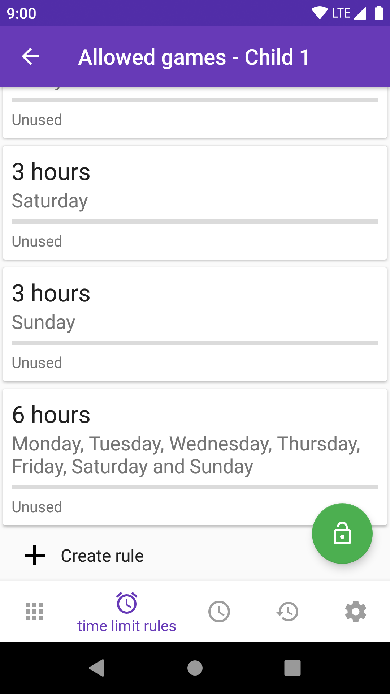

# Paus

This App allows setting time pauses for the usage of Android phones/ devices.

It is a fork of the App [Paus](https://paus.io)
with all networking related features removed.


### Building

Open it with Android Studio and press the Run button.

### Screenshots




### Enabling the device owner permission

```adb shell dpm set-device-owner io.paus.android.open/io.paus.android.integration.platform.android.AdminReceiver```
